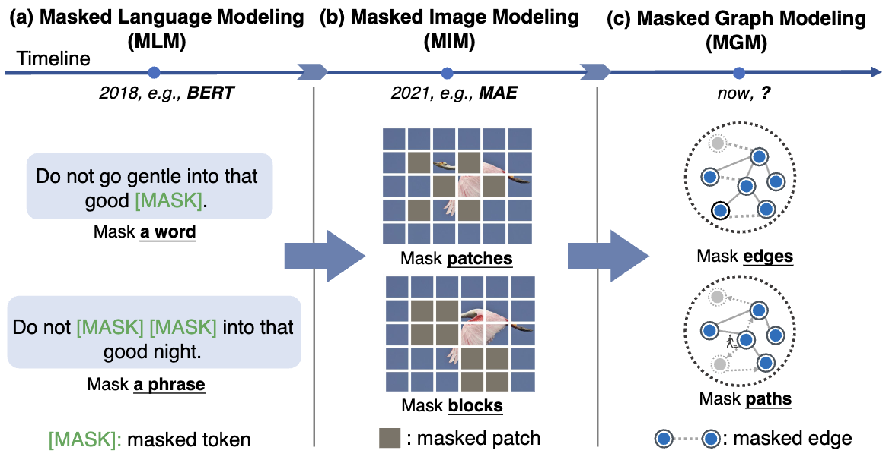

# What’s Behind the Mask: Understanding Masked Graph Modeling for Graph Autoencoders

#
Matías Francia

Diego Quezada

---
# Introducción

<!-- Abstract, introduction -->

- Éxito de graph SSL en varias áreas, particularmente en química y ciencas biomédicas, donde anotar datos es costoso

- Contrastive learning: funciona bien, pero depende demasiado en las tareas de creación de vistas aumentadas (*domain-specific*)

- Generative learning (GAE): no depende de la técnica de aumentación de datos, pero sobre-enfatiza la información próxima, a costa de la estructural

---
# Trabajo relacionado

  
  

<!-- Hay enfoques contemporáneos que también tratan de aprovechar las virtudes del enmascaramiento en grafos, pero carecen de respaldo teórico. Sólo muestran resultados empíricos -->

---
# Formulación del problema

- Sea $G = (V, E)$ un grafo no dirigido y no ponderado
- $V = \{ v_i \}$: conjunto de nodos
- $E \subseteq V \times V$: conjunto de aristas
- $\forall v \in V, \exist x_v \in \mathbb{R}^d$: *features* nodos
- $Z = \{ z_i \}_{i=1}^{|V|}$: representación latente

- **Tarea**: Aprender *encoder* de grafo $f_\theta$ que mapea el grafo $G$ a sus representaciones latentes de baja dimensión

---

# MaskGAE

---

### Estrategia de Masking

---

### Encoder - Decoder

---

### Función de pérdida

---

# Experimentos

---

# Conclusión

---

# Referencias