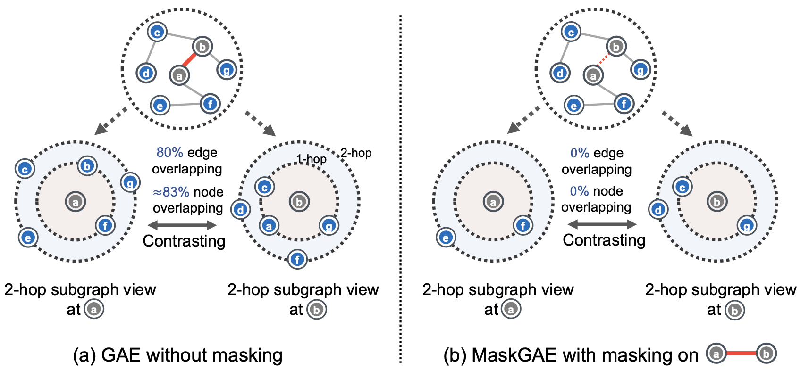

# What’s Behind the Mask: Understanding Masked Graph Modeling for Graph Autoencoders

#
Matías Francia

Diego Quezada

---
# Introducción

<!-- Abstract, introduction -->

- Éxito de graph SSL en varias áreas, particularmente en química y ciencas biomédicas, donde anotar datos es costoso

- Contrastive learning: funciona bien, pero depende demasiado en las tareas de creación de vistas aumentadas (*domain-specific*)

- Generative learning (GAE): no depende de la técnica de aumentación de datos, pero sobre-enfatiza la información próxima, a costa de la estructural

---
# Trabajo relacionado

  
  

<!-- Hay enfoques contemporáneos que también tratan de aprovechar las virtudes del enmascaramiento en grafos, pero carecen de respaldo teórico. Sólo muestran resultados empíricos -->

---
# Formulación del problema

- Sea $G = (V, E)$ un grafo no dirigido y no ponderado
- $V = \{ v_i \}$: conjunto de nodos
- $E \subseteq V \times V$: conjunto de aristas
- $\forall v \in V, \exist x_v \in \mathbb{R}^d$: *features* nodos
- $Z = \{ z_i \}_{i=1}^{|V|}$: representación latente

- **Tarea**: Aprender *encoder* de grafo $f_\theta$ que mapea el grafo $G$ a sus representaciones latentes de baja dimensión

---
# MaskGAE

  
  

---

### Estrategia de Masking

* Edge-wise random masking
* Path-wise random masking

  
  

---

### Modelo

* Encoder: GCN
* Structure Decoder: $h_w(z_u, z_v) = \sigma (\text{MLP}(z_u \cdot z_v))$
* Degree Decoder: $g_\phi(z_v) = \text{MLP}(z_v)$

---

### Función de pérdida

$$
\mathcal{L}_{\text{GAEs}} = -\frac{1}{\mathcal{E}^+} \sum_{u,v \in \mathcal{E}^+} \log h_w(z_u, z_v) - \frac{1}{\mathcal{E}^-} \sum_{u,v \in \mathcal{E}^-} \log 1 -  h_w(z_u, z_v)
$$

$$
\mathcal{L}_{\text{deg}} = \frac{1}{\mathcal{|V|}} = \sum_{v \in \mathcal{V}} || g_\phi (z_v) - deg_{\text{mask}}(v) ||^2_{F}
$$

$$
\mathcal{L} = \mathcal{L}_{\text{GAEs}} + \alpha \cdot \mathcal{L}_{\text{deg}}
$$

---

# Experimentos

---

# Conclusión

* A pesar de lo simple de la propuesta, para dos tareas y a través de distintos conjuntos de datos se obtienen resultados superiores.
* Limitaciones:
    * Aplicar masking daña el significado semántico de algunos gráficos, como el de las moléculas bioquímicas.
    * MaskGAE está fuertemente basado en el supuesto de homofilia, el cual puede no cumplirse en ciertos grafos como los heterofilicos.

---

# Referencias