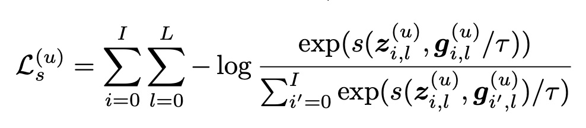
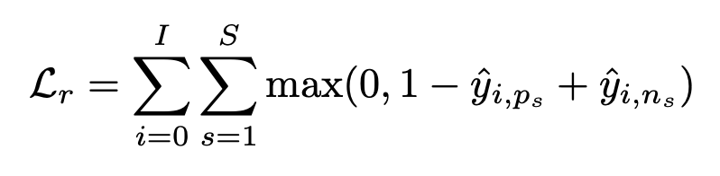
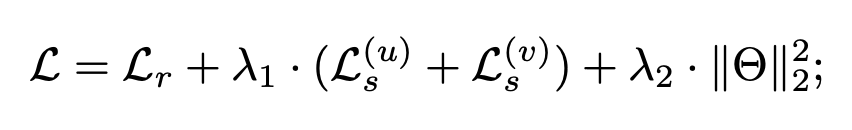

<style>
    
img[alt~="center"] {
  display: block;
  margin: 0 auto;
}

.center-align {
    margin-right: auto !important;
    margin-left: auto !important;
    text-align: center;
}

.right-align {
    text-align: right;
}

.figure-container {
  display: flex;
  justify-content: space-evenly;
  margin: 0 0 0 0;
  padding: 0 0 0 0;
}
</style>

# Sobre la Utilidad de VGAE en LightGCL


#
Matías Francia

Diego Quezada

---
# Contexto

* GNNs han demostrado su efectividad en sistemas recomendadores basados en grafos.
* La mayoría de los modelos de filtrado colaborativo basados en GNNs aprenden de manera supervisada, necesitando datos etiquetados.
* En la práctica aprender representaciones de usuarios e ítems es un gran desafío debido a que la matriz de interacción es sparse.
* GNNs integradas con contrastive learning han demostrado un desempeño superior en la tarea de recomendación junto a su esquema de data augmentation.


---
# Problema

Aprender representaciones de usuarios e ítems a partir de matrices de interacción sparse, capturando tanto información local como global del grafo.


---
# LightGCL [1]

* Es un framework de aprendizaje contrastivo en grafos entrenado para tareas de recomendación basado en GCN.
* Se basa en la generación de otra vista del grafo para el entrenamiento contrastivo, mediante el uso de una SVD. 
* La SVD busca generar una reconstrucción del grafo que contenga mayor información colaborativa global.
* Muestra una mejora en la eficiencia de entrenamiento respecto a otros enfoques basados en GCN. 

---
# Contribución

* Evaluar la utilidad de VGAE [2] para reconstruir la matriz de interacción en el framework LightGCL.

* **Inspiración** VGAE codifica la información colaborativa en el espacio latente, pues éste debe cumplir con la hipótesis de clustering. Esto debiese generar una mejor reconstrucción para la tarea de recomendación, en comparación con la SVD, que solo considera relaciones lineales entre los features.

<!-- * **Inspiración** VGAE codifica la información colaborativa en el espacio latente pues este debe cumplir con la hipótesis de clustering. Esto nos debería llevar a una mejorar reconstrucción en comparación a SVD. -->

<!--* ¿Por qué? La reconstrucción de la matriz de interacción realizada por SVD no considera relaciones a nivel de nodo. Qué pasa con la información colaborativa entre nodos ? co-ocurrencia ? -->


---
# Conjunto de datos Yelp

* 29,601 usuarios.
* 24,734 items.
* 1,517,327 interacciones.

---
# Implementación


---
## LightGCL

```python
class LightGCL(nn.Module):
    def __init__(self, n_u, n_i, u_mul_s,
        v_mul_s,
        ut, 
        vt, 
        train_csr,
        adj_norm, 
        l,   
        temp,
        lambda_1,
        lambda_2,
        dropout,
        batch_user,
        device):

    pass
```

---
## Definiciones

* Matriz de interacción $\mathcal{A}$: se normaliza ($\mathcal{\tilde{A}}$).
* Targets de aprendizaje supervisado: si existe o no la interacción entre un usuario $\textit{i}$ y un ítem $\textit{j}$.
* $\mathbf{US}$ y $\mathbf{VS}$: se precalculan para evitar la reconstrucción completa de la matriz de interacciones.
* Matriz de parámetros: corresponde a los embedding iniciales, se define una para la matriz de embeddings de ítems y otra para la de usuarios, se inicializa con Xavier Uniform.
* $\mathcal{l}$: cantidad de capas de las GCN.


---
## Definiciones
* Lista de $\mathcal{l+1}$ elementos: contienen los embedding de cada una de las capas de la GCN (incluyendo la inicial) de la vista 1.
* Listas $\mathbf{Z}$ y $\mathbf{G}$: se inicializan con $\mathcal{l+1}$ elementos, contienen los embeddings de la vista 1 y 2, respectivamente.
* Temperatura $\tau$: se define la temperatura que estará en la función de pérdida.
* Activación: se define como activación una LeakyReLU con valor 0.5.

---
## Función de pérdida

* Luego de las declaraciones se hace el forward pass y se actualizan los parámetros basándose en la unión de 2 funciones de pérdida: contrastiva ($\mathcal{L_s}$) y de recomendación ($\mathcal{L_r}$).

* Pérdida contrastiva:



---
## Función de pérdida

* Pérdida de recomendación:


* Pérdida total:


---

# Referencias

[1]: Cai, X., Huang, C., Xia, L., & Ren, X. (2023). LightGCL: Simple yet effective graph contrastive learning for recommendation. arXiv preprint arXiv:2302.08191.

[2]: Kipf, T. N., & Welling, M. (2016). Variational graph auto-encoders. arXiv preprint arXiv:1611.07308.