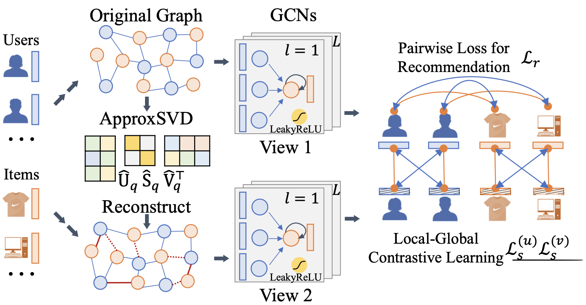
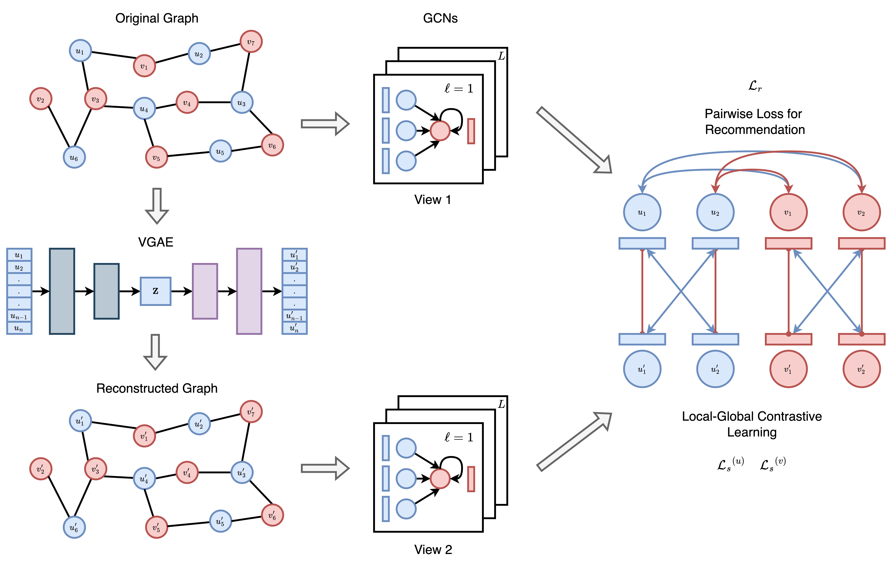
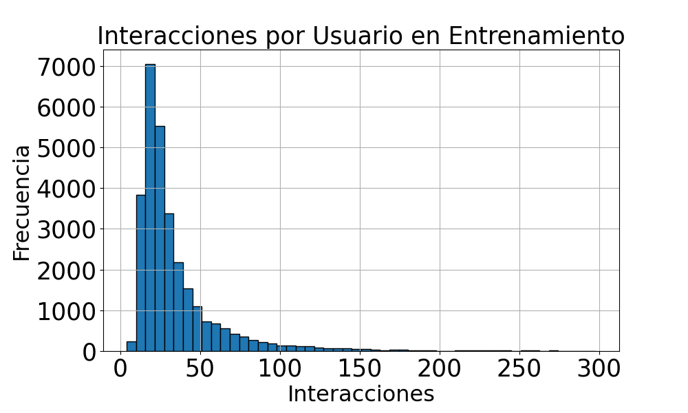
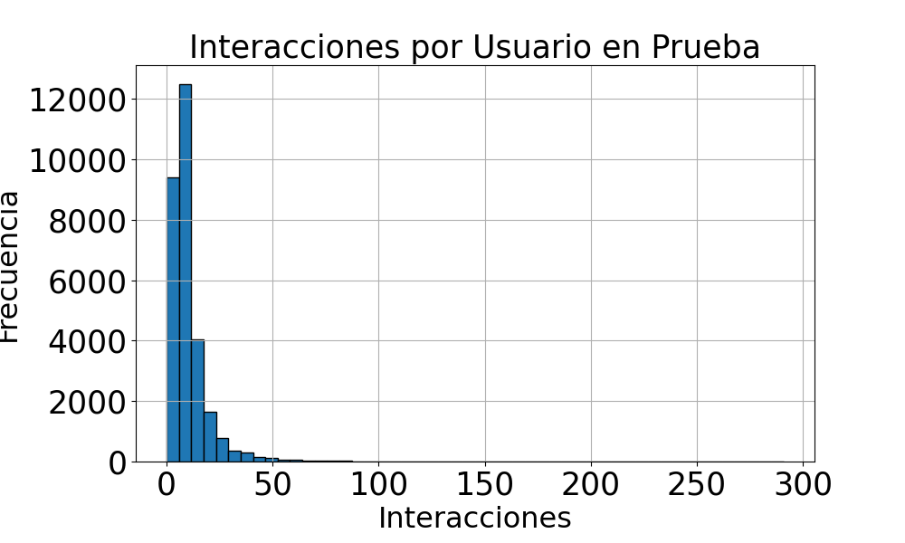
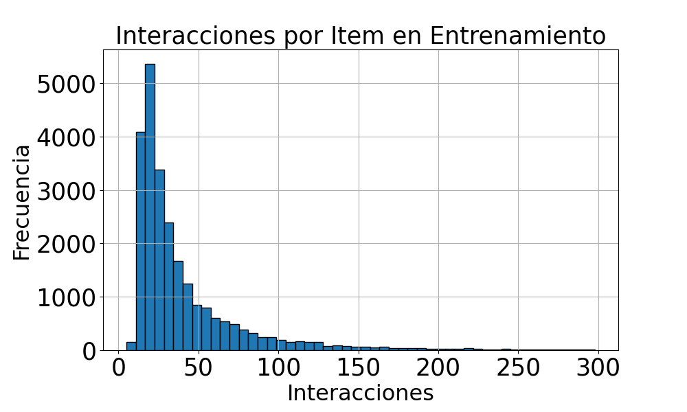
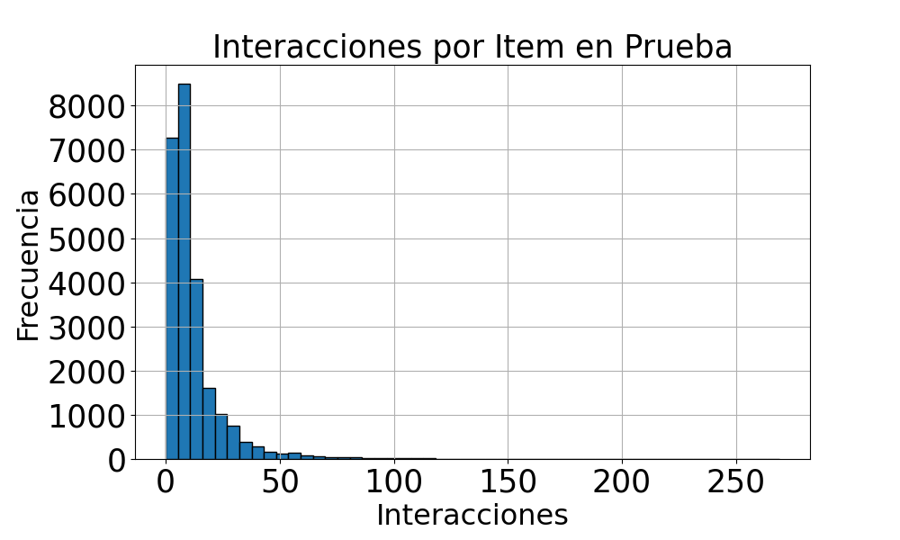

<style>
    
img[alt~="center"] {
  display: block;
  margin: 0 auto;
}

.center-align {
    margin-right: auto !important;
    margin-left: auto !important;
    text-align: center;
}

.right-align {
    text-align: right;
}

.figure-container {
  display: flex;
  justify-content: space-evenly;
  margin: 0 0 0 0;
  padding: 0 0 0 0;
}

</style>

# Sobre la Utilidad de VGAE en LightGCL


#
Matías Francia

Diego Quezada

---
# Contexto

* GNNs han demostrado su efectividad en sistemas recomendadores basados en grafos
* La mayoría de los modelos de filtrado colaborativo basados en GNNs aprenden de manera supervisada, necesitando datos etiquetados
* En la práctica aprender representaciones de usuarios e ítems es un gran desafío debido a que la matriz de interacción es sparse
* GNNs integradas con contrastive learning han demostrado un desempeño superior en la tarea de recomendación junto a su esquema de data augmentation


---
# Problema

Aprender representaciones de usuarios e ítems a partir de matrices de interacción sparse, capturando tanto información local como global del grafo


---
# LightGCL

* Es un framework de aprendizaje contrastivo en grafos entrenado para tareas de recomendación basado en GCN
* Se basa en la generación de otra vista del grafo para el entrenamiento contrastivo, mediante el uso de una SVD
* La SVD busca generar una reconstrucción del grafo que contenga mayor información colaborativa global
* Muestra una mejora en la eficiencia de entrenamiento respecto a otros enfoques basados en GCN

---

<div style="display: flex; justify-content: space-around; margin-top: 20px;">
  
  

</div>

---

## Configuración

* Tarea: Link prediction
* Datos: Matriz de interacción
* Modelo: GCN
* Función de pérdida: BPR y CL

---

## Profundizando

### Datos de entrada
* Matriz de interacción original normalizada $\mathcal{\tilde{A}}$
* Matriz de interacción reconstruida (SVD) $\mathcal{\hat{A}}$


---
### Configuración GCN: 
* $\mathcal{l}$ capas de paso de mensajes
* Listas de matrices de embeddings, todos con $\mathcal{l+1}$ dimensiones:
  * $\mathbf{E_u}$, $\mathbf{E_i}$: matrices usadas para paso de mensajes, primer elemento de cada una son los parámetros entrenables del modelo
  * $\mathbf{Z_u}$, $\mathbf{Z_i}$ / $\mathbf{G_u}$, $\mathbf{G_i}$: embeddings de vista 1 y vista 2, respectivamente
* Activaciones: Sigmoide (BPR) y Softmax con temperatura $\tau$ (CL)


---

* Luego de las declaraciones se hace el forward pass y se actualizan los parámetros basándose en la unión de 2 funciones de pérdida: contrastiva ($\mathcal{L_s}$) y de recomendación ($\mathcal{L_r}$).

* Pérdida contrastiva:


---

* Pérdida de recomendación:


* Pérdida total:


---
# Contribución

<!-- Limitaciones de SVD -->
<!-- Agregar acá -->

* **Limitaciones LightGCL:** SVD asume que las relaciones entre las características son lineales, lo que puede limitar su capacidad para capturar relaciones no lineales

* **Inspiración** VGAE codifica la información colaborativa en el espacio latente, pues éste debe cumplir con la hipótesis de clustering. Esto debiese generar una mejor reconstrucción para la tarea de recomendación, en comparación con la SVD
  
* **Contribución:** Evaluar la utilidad de VGAE para reconstruir la matriz de interacción en el framework LightGCL


---

<div style="display: flex; justify-content: space-around; margin-top: 20px;">
  
  

</div>

---
# Avances

1. Análisis de datos
2. Revisión de código fuente y entrenamiento LightGCL

---

## 1. Análisis de datos

* LightGCL utiliza los siguientes *datasets*: **Yelp**, Gowalla, ML-10M, Amazon y Tmall.
* En este proyecto utilizaremos el conjunto de datos **Yelp**.
* Yelp es una plataforma donde usuarios califican y reseñan negocios locales.

---

<div style="display: flex; justify-content: space-around;">

  <!-- First Table with Bottom Caption -->
  <div style="text-align: center;">
    <table style="font-size: 20px; margin: 10px; text-align: center;">
      <tr>
        <th>Métrica</th>
        <th>Valor</th>
      </tr>
      <tr>
        <td>Número de usuarios</td>
        <td>29,601</td>
      </tr>
      <tr>
        <td>Número de ítems</td>
        <td>24,734</td>
      </tr>
      <tr>
        <td>Número de interacciones</td>
        <td>1,069,128</td>
      </tr>
      <tr>
        <td>Promedio de interacciones por usuario</td>
        <td>36.12</td>
      </tr>
      <tr>
        <td>Promedio de interacciones por ítem</td>
        <td>43.23</td>
      </tr>
      <tr>
        <td>Máximo de interacciones por usuario</td>
        <td>1,282</td>
      </tr>
      <tr>
        <td>Máximo de interacciones por ítem</td>
        <td>926</td>
      </tr>
      <tr>
        <td>Densidad de la matriz</td>
        <td>0.15%</td>
      </tr>
    </table>
    <div style="font-weight: bold; font-size: 20px; margin-top: 5px;">Entrenamiento</div>
  </div>

  <!-- Second Table with Bottom Caption -->
  <div style="text-align: center;">
    <table style="font-size: 20px; margin: 10px; text-align: center;">
      <tr>
        <th>Métrica</th>
        <th>Valor</th>
      </tr>
      <tr>
        <td>Número de usuarios</td>
        <td>29,530</td>
      </tr>
      <tr>
        <td>Número de ítems</td>
        <td>24,679</td>
      </tr>
      <tr>
        <td>Número de interacciones</td>
        <td>305,466</td>
      </tr>
      <tr>
        <td>Promedio de interacciones por usuario</td>
        <td>10.32</td>
      </tr>
      <tr>
        <td>Promedio de interacciones por ítem</td>
        <td>12.35</td>
      </tr>
      <tr>
        <td>Máximo de interacciones por usuario</td>
        <td>370</td>
      </tr>
      <tr>
        <td>Máximo de interacciones por ítem</td>
        <td>269</td>
      </tr>
      <tr>
        <td>Densidad de la matriz</td>
        <td>0.04%</td>
      </tr>
    </table>
    <div style="font-weight: bold; font-size: 20px; margin-top: 5px;">Prueba</div>
  </div>

</div>


---

<div style="display: flex; justify-content: space-around; margin-top: 20px;">

  
  
  

</div>

---

<div style="display: flex; justify-content: space-around; margin-top: 20px;">

  
  
  

</div>


---
## 3. Entrenamiento de LightGCL

```python
# Install Python 3.9
sudo apt-get install python3.9
sudo update-alternatives --install /usr/bin/python3 python3 /usr/bin/python3.9 1

# Install pip
sudo apt-get install python3.9-distutils
wget https://bootstrap.pypa.io/get-pip.py
python3.9 get-pip.py

# Clone LightGCL
git clone https://github.com/HKUDS/LightGCL.git

# Install torch, numpy, tqdm
python -m pip install -r requirements.txt

# Start training
python main.py --data yelp
```

---

<div style="display: flex; justify-content: center;">

  <!-- Table with Epoch and Metrics -->
  <div style="text-align: center;">
    <table style="font-size: 20px; margin: 10px; text-align: center;">
      <tr>
        <th>Epoch</th>
        <th>Recall@20</th>
        <th>Ndcg@20</th>
        <th>Recall@40</th>
        <th>Ndcg@40</th>
      </tr>
      <tr>
        <td>1</td>
        <td>0.058</td>
        <td>0.049</td>
        <td>0.096</td>
        <td>0.063</td>
      </tr>
      <tr>
        <td>25</td>
        <td>0.096</td>
        <td>0.082</td>
        <td>0.15</td>
        <td>0.10</td>
      </tr>
      <tr>
        <td>50</td>
        <td>0.099</td>
        <td>0.085</td>
        <td>0.16</td>
        <td>0.11</td>
      </tr>
      <tr>
        <td>100</td>
        <td>0.10</td>
        <td>0.085</td>
        <td>0.16</td>
        <td>0.11</td>
      </tr>
      <!-- Add more rows as needed -->
    </table>
    <div style="font-weight: bold; font-size: 20px; margin-top: 5px;">Evaluación en conjunto de Prueba</div>
  </div>

</div>


---

# Referencias

[1]: Cai, X., Huang, C., Xia, L., & Ren, X. (2023). LightGCL: Simple yet effective graph contrastive learning for recommendation. arXiv preprint arXiv:2302.08191.

[2]: Kipf, T. N., & Welling, M. (2016). Variational graph auto-encoders. arXiv preprint arXiv:1611.07308.